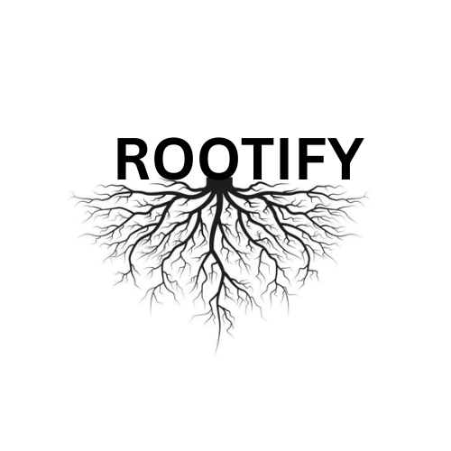

# Rootify

    

**Rootify** is a full-stack web application designed to empower farmers and administrators with smart agricultural insights. It provides a platform for admins to share vital information about soil types and distributors, while offering users a powerful AI assistant for advanced agricultural queries, including plant disease diagnosis from images.

## Table of Contents

-   [Features](#features)
-   [Technologies Used](#technologies-used)
-   [Project Structure](#project-structure)
-   [Getting Started](#getting-started)
-   [Admin and User Accounts](#admin-and-user-accounts)
-   [API Key Setup](#api-key-setup)
-   [Deployment](#deployment)
-   [Future Enhancements](#future-enhancements)
-   [Contributing](#contributing)
-   [License](#license)

---

## Features

-   **User and Admin Roles:** A secure login system with separate dashboards and functionalities for users and administrators.
-   **Public Data View:** Logged-in users can view all shared soil types and distributor information.
-   **Admin-Specific Data Management:** Admins can post, view, and manage only the soil and distributor data they have added. This ensures data segregation and personal accountability.
-   **Multimodal AI Chatbot:** A fixed-position AI assistant powered by the Gemini API that provides agriculture-related answers. It supports both text questions and image uploads for tasks like crop disease identification.
-   **Responsive Design:** The application is built to be accessible and visually appealing on various devices, from desktops to mobile phones.

---

## Technologies Used

-   **Frontend:**
    -   HTML5, CSS3 (with glassmorphism styling)
    -   Vanilla JavaScript (ES6 Modules)
-   **Backend:**
    -   Node.js (for the proxy server)
    -   Express.js (to create the API endpoint)
    -   `@google/generative-ai` SDK
    -   `dotenv` (for secure environment variables)
-   **Database & Authentication:**
    -   Firebase Firestore
    -   Firebase Authentication (Email/Password & Google Sign-in)
-   **Deployment:**
    -   A service capable of hosting a Node.js server and static files (e.g., Vercel, Netlify, Firebase Hosting + Functions).

---

## Project Structure

The project follows a standard structure that separates frontend static files from backend server logic.
